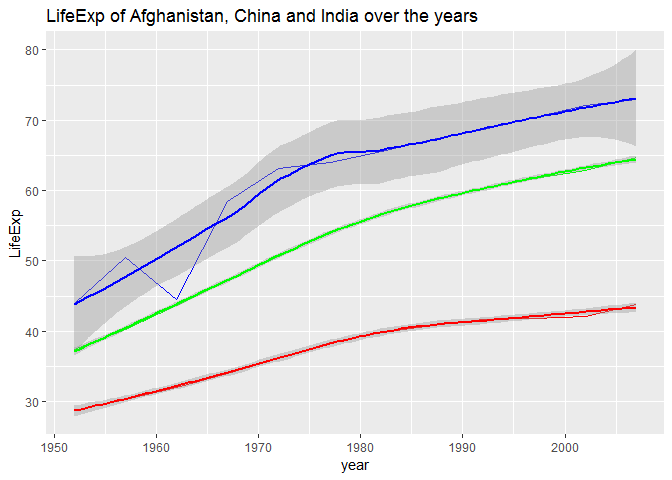

#### Data set used: Gapminder Dataset


#### Loading packages


```r
library(gapminder)
library(tidyverse)
```

```
## -- Attaching packages -------------------------------------------------- tidyverse 1.2.1 --
```

```
## v ggplot2 3.0.0     v purrr   0.2.5
## v tibble  1.4.2     v dplyr   0.7.6
## v tidyr   0.8.1     v stringr 1.3.1
## v readr   1.1.1     v forcats 0.3.0
```

```
## -- Conflicts ----------------------------------------------------- tidyverse_conflicts() --
## x dplyr::filter() masks stats::filter()
## x dplyr::lag()    masks stats::lag()
```

```r
library(tidyr)
library(dplyr)
library(kableExtra)
library(knitr)
```


#### **Tasks required for this assignment:**

1. Pick one of the data reshaping prompts and do it.
2. Pick one of the join prompts and do it.


#### **Data Reshaping prompts**


Selecting **Activity#2**

`Activity #`: Make a tibble with one row per year and columns for life expectancy for two or more countries. Use knitr::kable() to make this table look pretty in your rendered homework. Take advantage of this new data shape to scatterplot life expectancy for one country against that of another.


Tidy data is data that’s easy to work with: it’s easy to munge (with dplyr), visualise (with ggplot2 or ggvis) and model (with R’s hundreds of modelling packages). The two most important properties of tidy data are:


- Each column is a variable.

- Each row is an observation.

This prompt enables us to `convert the gapminder untiday data to tidy data`.


**Looking into the untidy gapminder data frame**


```r
head(gapminder) %>% 
  knitr::kable(format = "markdown") %>% 
    kable_styling(bootstrap_options = "bordered",latex_options = "basic",full_width = F)
```

```
## Warning in kable_styling(., bootstrap_options = "bordered", latex_options =
## "basic", : Please specify format in kable. kableExtra can customize either
## HTML or LaTeX outputs. See https://haozhu233.github.io/kableExtra/ for
## details.
```


|country     |continent | year| lifeExp|      pop| gdpPercap|
|:-----------|:---------|----:|-------:|--------:|---------:|
|Afghanistan |Asia      | 1952|  28.801|  8425333|  779.4453|
|Afghanistan |Asia      | 1957|  30.332|  9240934|  820.8530|
|Afghanistan |Asia      | 1962|  31.997| 10267083|  853.1007|
|Afghanistan |Asia      | 1967|  34.020| 11537966|  836.1971|
|Afghanistan |Asia      | 1972|  36.088| 13079460|  739.9811|
|Afghanistan |Asia      | 1977|  38.438| 14880372|  786.1134|


`Next`, we convert this undity data into tidy data by using `gather()` and `spread()` function from `tidyr`. To perform this operation, we select the following two `Asian Countries` viz ` Afghanistan, China and India`.


```r
tidy_gap <- gapminder %>% 
  filter(country == "Afghanistan"| country == "China"| country == "India") %>% 
  select(year, country, lifeExp) %>% 
  #rename(NewZealand = "New_Zealand") %>% 
  spread(key = "country", value = "lifeExp") 

kable(tidy_gap, format = "markdown") %>% 
  kable_styling(bootstrap_options = "bordered",latex_options = "basic",full_width = F)
```

```
## Warning in kable_styling(., bootstrap_options = "bordered", latex_options =
## "basic", : Please specify format in kable. kableExtra can customize either
## HTML or LaTeX outputs. See https://haozhu233.github.io/kableExtra/ for
## details.
```


| year| Afghanistan|    China|  India|
|----:|-----------:|--------:|------:|
| 1952|      28.801| 44.00000| 37.373|
| 1957|      30.332| 50.54896| 40.249|
| 1962|      31.997| 44.50136| 43.605|
| 1967|      34.020| 58.38112| 47.193|
| 1972|      36.088| 63.11888| 50.651|
| 1977|      38.438| 63.96736| 54.208|
| 1982|      39.854| 65.52500| 56.596|
| 1987|      40.822| 67.27400| 58.553|
| 1992|      41.674| 68.69000| 60.223|
| 1997|      41.763| 70.42600| 61.765|
| 2002|      42.129| 72.02800| 62.879|
| 2007|      43.828| 72.96100| 64.698|


**Using the above clean `tidy_gap` data lets visualise the change in lifeExp over the yeats for these two countries**


```r
  ggplot(tidy_gap) +
  geom_line(aes(year, Afghanistan), color = "red") +
  geom_smooth(aes(year, Afghanistan), color = "red") +
  geom_line(aes(year, China), color = "blue") +
  geom_smooth(aes(year, China), color = "blue") +
  geom_line(aes(year, India), color = "green") +
  geom_smooth(aes(year, India), color = "green")+
  labs(title = "LifeExp of Afghanistan, China and India over the years") +
  ylab("LifeExp")
```

```
## `geom_smooth()` using method = 'loess' and formula 'y ~ x'
## `geom_smooth()` using method = 'loess' and formula 'y ~ x'
## `geom_smooth()` using method = 'loess' and formula 'y ~ x'
```

<!-- -->


As we can see from the above figure that the lifeExp for both India and Afghanistan have been increasing first at a slower rate and then at a faster rate. On the other hand, the lifeExp of China has seen ups and downs over the year, even though, its average lifeExp is highest.


#### **Join Prompts(Join, merge, lookup)


`**Activity#1**`

Create a second data frame, complementary to Gapminder. Join this with (part of) Gapminder using a dplyr join function and make some observations about the process and result. Explore the different types of joins. Examples of a second data frame you could build:

- One row per country, a country variable and one or more variables with extra info, such as language spoken, NATO membership, national animal, or capitol city.

- One row per continent, a continent variable and one or more variables with extra info, such as northern versus southern hemisphere.


In this task, I created a tibble of three variables named `country, pop and capital_city` using the `tibble()` function. The data frame created was stored in a variable called `new_data`.


```r
new_data<- tibble(country = c("Afghanistan", "India", "China", "Australia", "New Zealand"), pop = c("36183003", "134000000", "140000000", "25000000", "4609755"), capital_city = c("Kabul", "Delhi", "Beijing", "Canberra", "Wellington") )

kable(new_data, format= "markdown") %>% 
  kable_styling(bootstrap_options = "bordered",latex_options = "basic",full_width = F)
```

```
## Warning in kable_styling(., bootstrap_options = "bordered", latex_options =
## "basic", : Please specify format in kable. kableExtra can customize either
## HTML or LaTeX outputs. See https://haozhu233.github.io/kableExtra/ for
## details.
```


|country     |pop       |capital_city |
|:-----------|:---------|:------------|
|Afghanistan |36183003  |Kabul        |
|India       |134000000 |Delhi        |
|China       |140000000 |Beijing      |
|Australia   |25000000  |Canberra     |
|New Zealand |4609755   |Wellington   |


**Exploring the data frame `new_data`**


```r
colnames(new_data)
```

```
## [1] "country"      "pop"          "capital_city"
```

```r
class(new_data)
```

```
## [1] "tbl_df"     "tbl"        "data.frame"
```

```r
typeof(new_data)
```

```
## [1] "list"
```

```r
dim(new_data)
```

```
## [1] 5 3
```


Lets perform combining, filtering and binding operations on the two data frames: `gapminder and new_data`


##### **Left Join**


```r
kable(head(left_join(gapminder,new_data,by = "country")), format = "markdown") %>% 
  kable_styling(bootstrap_options = "bordered",latex_options = "basic",full_width = F)
```

```
## Warning: Column `country` joining factor and character vector, coercing
## into character vector
```

```
## Warning in kable_styling(., bootstrap_options = "bordered", latex_options =
## "basic", : Please specify format in kable. kableExtra can customize either
## HTML or LaTeX outputs. See https://haozhu233.github.io/kableExtra/ for
## details.
```


|country     |continent | year| lifeExp|    pop.x| gdpPercap|pop.y    |capital_city |
|:-----------|:---------|----:|-------:|--------:|---------:|:--------|:------------|
|Afghanistan |Asia      | 1952|  28.801|  8425333|  779.4453|36183003 |Kabul        |
|Afghanistan |Asia      | 1957|  30.332|  9240934|  820.8530|36183003 |Kabul        |
|Afghanistan |Asia      | 1962|  31.997| 10267083|  853.1007|36183003 |Kabul        |
|Afghanistan |Asia      | 1967|  34.020| 11537966|  836.1971|36183003 |Kabul        |
|Afghanistan |Asia      | 1972|  36.088| 13079460|  739.9811|36183003 |Kabul        |
|Afghanistan |Asia      | 1977|  38.438| 14880372|  786.1134|36183003 |Kabul        |


We can see that left joins retains the entire gapminder data frame and adds the column variables of the new_data data frame onto that by matching countries. The output below shows that all those countries which have no matching country in the new_data data frame have the new variables as `NA`.


```r
kable(tail(left_join(gapminder,new_data,by = "country")), format = "markdown") %>% 
  kable_styling(bootstrap_options = "bordered",latex_options = "basic",full_width = F)
```

```
## Warning: Column `country` joining factor and character vector, coercing
## into character vector
```

```
## Warning in kable_styling(., bootstrap_options = "bordered", latex_options =
## "basic", : Please specify format in kable. kableExtra can customize either
## HTML or LaTeX outputs. See https://haozhu233.github.io/kableExtra/ for
## details.
```


|country  |continent | year| lifeExp|    pop.x| gdpPercap|pop.y |capital_city |
|:--------|:---------|----:|-------:|--------:|---------:|:-----|:------------|
|Zimbabwe |Africa    | 1982|  60.363|  7636524|  788.8550|NA    |NA           |
|Zimbabwe |Africa    | 1987|  62.351|  9216418|  706.1573|NA    |NA           |
|Zimbabwe |Africa    | 1992|  60.377| 10704340|  693.4208|NA    |NA           |
|Zimbabwe |Africa    | 1997|  46.809| 11404948|  792.4500|NA    |NA           |
|Zimbabwe |Africa    | 2002|  39.989| 11926563|  672.0386|NA    |NA           |
|Zimbabwe |Africa    | 2007|  43.487| 12311143|  469.7093|NA    |NA           |


##### **Right Join**


```r
kable(head((right_join(gapminder,new_data,by = "country")), format = "markdown")) 
```

```
## Warning: Column `country` joining factor and character vector, coercing
## into character vector
```

<table>
 <thead>
  <tr>
   <th style="text-align:left;"> country </th>
   <th style="text-align:left;"> continent </th>
   <th style="text-align:right;"> year </th>
   <th style="text-align:right;"> lifeExp </th>
   <th style="text-align:right;"> pop.x </th>
   <th style="text-align:right;"> gdpPercap </th>
   <th style="text-align:left;"> pop.y </th>
   <th style="text-align:left;"> capital_city </th>
  </tr>
 </thead>
<tbody>
  <tr>
   <td style="text-align:left;"> Afghanistan </td>
   <td style="text-align:left;"> Asia </td>
   <td style="text-align:right;"> 1952 </td>
   <td style="text-align:right;"> 28.801 </td>
   <td style="text-align:right;"> 8425333 </td>
   <td style="text-align:right;"> 779.4453 </td>
   <td style="text-align:left;"> 36183003 </td>
   <td style="text-align:left;"> Kabul </td>
  </tr>
  <tr>
   <td style="text-align:left;"> Afghanistan </td>
   <td style="text-align:left;"> Asia </td>
   <td style="text-align:right;"> 1957 </td>
   <td style="text-align:right;"> 30.332 </td>
   <td style="text-align:right;"> 9240934 </td>
   <td style="text-align:right;"> 820.8530 </td>
   <td style="text-align:left;"> 36183003 </td>
   <td style="text-align:left;"> Kabul </td>
  </tr>
  <tr>
   <td style="text-align:left;"> Afghanistan </td>
   <td style="text-align:left;"> Asia </td>
   <td style="text-align:right;"> 1962 </td>
   <td style="text-align:right;"> 31.997 </td>
   <td style="text-align:right;"> 10267083 </td>
   <td style="text-align:right;"> 853.1007 </td>
   <td style="text-align:left;"> 36183003 </td>
   <td style="text-align:left;"> Kabul </td>
  </tr>
  <tr>
   <td style="text-align:left;"> Afghanistan </td>
   <td style="text-align:left;"> Asia </td>
   <td style="text-align:right;"> 1967 </td>
   <td style="text-align:right;"> 34.020 </td>
   <td style="text-align:right;"> 11537966 </td>
   <td style="text-align:right;"> 836.1971 </td>
   <td style="text-align:left;"> 36183003 </td>
   <td style="text-align:left;"> Kabul </td>
  </tr>
  <tr>
   <td style="text-align:left;"> Afghanistan </td>
   <td style="text-align:left;"> Asia </td>
   <td style="text-align:right;"> 1972 </td>
   <td style="text-align:right;"> 36.088 </td>
   <td style="text-align:right;"> 13079460 </td>
   <td style="text-align:right;"> 739.9811 </td>
   <td style="text-align:left;"> 36183003 </td>
   <td style="text-align:left;"> Kabul </td>
  </tr>
  <tr>
   <td style="text-align:left;"> Afghanistan </td>
   <td style="text-align:left;"> Asia </td>
   <td style="text-align:right;"> 1977 </td>
   <td style="text-align:right;"> 38.438 </td>
   <td style="text-align:right;"> 14880372 </td>
   <td style="text-align:right;"> 786.1134 </td>
   <td style="text-align:left;"> 36183003 </td>
   <td style="text-align:left;"> Kabul </td>
  </tr>
</tbody>
</table>


Right_join retains the new_data frame and matches the gapminder data frame with the new_data by matching columns. Also, similar to left_join, the countries which have not match have no variable in the right_join data frame.


```r
kable(tail(right_join(gapminder,new_data,by = "country")), format = "markdown") %>% 
  kable_styling(bootstrap_options = "bordered",latex_options = "basic",full_width = F)
```

```
## Warning: Column `country` joining factor and character vector, coercing
## into character vector
```

```
## Warning in kable_styling(., bootstrap_options = "bordered", latex_options =
## "basic", : Please specify format in kable. kableExtra can customize either
## HTML or LaTeX outputs. See https://haozhu233.github.io/kableExtra/ for
## details.
```


|country     |continent | year| lifeExp|   pop.x| gdpPercap|pop.y   |capital_city |
|:-----------|:---------|----:|-------:|-------:|---------:|:-------|:------------|
|New Zealand |Oceania   | 1982|  73.840| 3210650|  17632.41|4609755 |Wellington   |
|New Zealand |Oceania   | 1987|  74.320| 3317166|  19007.19|4609755 |Wellington   |
|New Zealand |Oceania   | 1992|  76.330| 3437674|  18363.32|4609755 |Wellington   |
|New Zealand |Oceania   | 1997|  77.550| 3676187|  21050.41|4609755 |Wellington   |
|New Zealand |Oceania   | 2002|  79.110| 3908037|  23189.80|4609755 |Wellington   |
|New Zealand |Oceania   | 2007|  80.204| 4115771|  25185.01|4609755 |Wellington   |


##### **Inner Join**


Inner_join matches the two data frames based only on same rows and discards all the other rows.


```r
kable(head((inner_join(gapminder,new_data,by = "country")), format = "markdown")) %>% 
  kable_styling(bootstrap_options = "bordered",latex_options = "basic",full_width = F)
```

```
## Warning: Column `country` joining factor and character vector, coercing
## into character vector
```

<table class="table table-bordered" style="width: auto !important; margin-left: auto; margin-right: auto;">
 <thead>
  <tr>
   <th style="text-align:left;"> country </th>
   <th style="text-align:left;"> continent </th>
   <th style="text-align:right;"> year </th>
   <th style="text-align:right;"> lifeExp </th>
   <th style="text-align:right;"> pop.x </th>
   <th style="text-align:right;"> gdpPercap </th>
   <th style="text-align:left;"> pop.y </th>
   <th style="text-align:left;"> capital_city </th>
  </tr>
 </thead>
<tbody>
  <tr>
   <td style="text-align:left;"> Afghanistan </td>
   <td style="text-align:left;"> Asia </td>
   <td style="text-align:right;"> 1952 </td>
   <td style="text-align:right;"> 28.801 </td>
   <td style="text-align:right;"> 8425333 </td>
   <td style="text-align:right;"> 779.4453 </td>
   <td style="text-align:left;"> 36183003 </td>
   <td style="text-align:left;"> Kabul </td>
  </tr>
  <tr>
   <td style="text-align:left;"> Afghanistan </td>
   <td style="text-align:left;"> Asia </td>
   <td style="text-align:right;"> 1957 </td>
   <td style="text-align:right;"> 30.332 </td>
   <td style="text-align:right;"> 9240934 </td>
   <td style="text-align:right;"> 820.8530 </td>
   <td style="text-align:left;"> 36183003 </td>
   <td style="text-align:left;"> Kabul </td>
  </tr>
  <tr>
   <td style="text-align:left;"> Afghanistan </td>
   <td style="text-align:left;"> Asia </td>
   <td style="text-align:right;"> 1962 </td>
   <td style="text-align:right;"> 31.997 </td>
   <td style="text-align:right;"> 10267083 </td>
   <td style="text-align:right;"> 853.1007 </td>
   <td style="text-align:left;"> 36183003 </td>
   <td style="text-align:left;"> Kabul </td>
  </tr>
  <tr>
   <td style="text-align:left;"> Afghanistan </td>
   <td style="text-align:left;"> Asia </td>
   <td style="text-align:right;"> 1967 </td>
   <td style="text-align:right;"> 34.020 </td>
   <td style="text-align:right;"> 11537966 </td>
   <td style="text-align:right;"> 836.1971 </td>
   <td style="text-align:left;"> 36183003 </td>
   <td style="text-align:left;"> Kabul </td>
  </tr>
  <tr>
   <td style="text-align:left;"> Afghanistan </td>
   <td style="text-align:left;"> Asia </td>
   <td style="text-align:right;"> 1972 </td>
   <td style="text-align:right;"> 36.088 </td>
   <td style="text-align:right;"> 13079460 </td>
   <td style="text-align:right;"> 739.9811 </td>
   <td style="text-align:left;"> 36183003 </td>
   <td style="text-align:left;"> Kabul </td>
  </tr>
  <tr>
   <td style="text-align:left;"> Afghanistan </td>
   <td style="text-align:left;"> Asia </td>
   <td style="text-align:right;"> 1977 </td>
   <td style="text-align:right;"> 38.438 </td>
   <td style="text-align:right;"> 14880372 </td>
   <td style="text-align:right;"> 786.1134 </td>
   <td style="text-align:left;"> 36183003 </td>
   <td style="text-align:left;"> Kabul </td>
  </tr>
</tbody>
</table>


##### **Full Join**


Full join is basically like a union and joins all the matching and non-matching rows.


```r
kable(head((full_join(gapminder,new_data,by = "country")), format = "markdown")) %>% 
  kable_styling(bootstrap_options = "bordered",latex_options = "basic",full_width = F)
```

```
## Warning: Column `country` joining factor and character vector, coercing
## into character vector
```

<table class="table table-bordered" style="width: auto !important; margin-left: auto; margin-right: auto;">
 <thead>
  <tr>
   <th style="text-align:left;"> country </th>
   <th style="text-align:left;"> continent </th>
   <th style="text-align:right;"> year </th>
   <th style="text-align:right;"> lifeExp </th>
   <th style="text-align:right;"> pop.x </th>
   <th style="text-align:right;"> gdpPercap </th>
   <th style="text-align:left;"> pop.y </th>
   <th style="text-align:left;"> capital_city </th>
  </tr>
 </thead>
<tbody>
  <tr>
   <td style="text-align:left;"> Afghanistan </td>
   <td style="text-align:left;"> Asia </td>
   <td style="text-align:right;"> 1952 </td>
   <td style="text-align:right;"> 28.801 </td>
   <td style="text-align:right;"> 8425333 </td>
   <td style="text-align:right;"> 779.4453 </td>
   <td style="text-align:left;"> 36183003 </td>
   <td style="text-align:left;"> Kabul </td>
  </tr>
  <tr>
   <td style="text-align:left;"> Afghanistan </td>
   <td style="text-align:left;"> Asia </td>
   <td style="text-align:right;"> 1957 </td>
   <td style="text-align:right;"> 30.332 </td>
   <td style="text-align:right;"> 9240934 </td>
   <td style="text-align:right;"> 820.8530 </td>
   <td style="text-align:left;"> 36183003 </td>
   <td style="text-align:left;"> Kabul </td>
  </tr>
  <tr>
   <td style="text-align:left;"> Afghanistan </td>
   <td style="text-align:left;"> Asia </td>
   <td style="text-align:right;"> 1962 </td>
   <td style="text-align:right;"> 31.997 </td>
   <td style="text-align:right;"> 10267083 </td>
   <td style="text-align:right;"> 853.1007 </td>
   <td style="text-align:left;"> 36183003 </td>
   <td style="text-align:left;"> Kabul </td>
  </tr>
  <tr>
   <td style="text-align:left;"> Afghanistan </td>
   <td style="text-align:left;"> Asia </td>
   <td style="text-align:right;"> 1967 </td>
   <td style="text-align:right;"> 34.020 </td>
   <td style="text-align:right;"> 11537966 </td>
   <td style="text-align:right;"> 836.1971 </td>
   <td style="text-align:left;"> 36183003 </td>
   <td style="text-align:left;"> Kabul </td>
  </tr>
  <tr>
   <td style="text-align:left;"> Afghanistan </td>
   <td style="text-align:left;"> Asia </td>
   <td style="text-align:right;"> 1972 </td>
   <td style="text-align:right;"> 36.088 </td>
   <td style="text-align:right;"> 13079460 </td>
   <td style="text-align:right;"> 739.9811 </td>
   <td style="text-align:left;"> 36183003 </td>
   <td style="text-align:left;"> Kabul </td>
  </tr>
  <tr>
   <td style="text-align:left;"> Afghanistan </td>
   <td style="text-align:left;"> Asia </td>
   <td style="text-align:right;"> 1977 </td>
   <td style="text-align:right;"> 38.438 </td>
   <td style="text-align:right;"> 14880372 </td>
   <td style="text-align:right;"> 786.1134 </td>
   <td style="text-align:left;"> 36183003 </td>
   <td style="text-align:left;"> Kabul </td>
  </tr>
</tbody>
</table>


As, we can see that, all the rows that have no matching variables in the new_data data frame was no value in the full_join data set.


##### **Semi join


This join joins the rows that have match in both the data frames.


```r
kable(tail((semi_join(gapminder,new_data,by = "country")), format = "markdown")) %>% 
  kable_styling(bootstrap_options = "bordered",latex_options = "basic",full_width = F)
```

```
## Warning: Column `country` joining factor and character vector, coercing
## into character vector
```

<table class="table table-bordered" style="width: auto !important; margin-left: auto; margin-right: auto;">
 <thead>
  <tr>
   <th style="text-align:left;"> country </th>
   <th style="text-align:left;"> continent </th>
   <th style="text-align:right;"> year </th>
   <th style="text-align:right;"> lifeExp </th>
   <th style="text-align:right;"> pop </th>
   <th style="text-align:right;"> gdpPercap </th>
  </tr>
 </thead>
<tbody>
  <tr>
   <td style="text-align:left;"> New Zealand </td>
   <td style="text-align:left;"> Oceania </td>
   <td style="text-align:right;"> 1982 </td>
   <td style="text-align:right;"> 73.840 </td>
   <td style="text-align:right;"> 3210650 </td>
   <td style="text-align:right;"> 17632.41 </td>
  </tr>
  <tr>
   <td style="text-align:left;"> New Zealand </td>
   <td style="text-align:left;"> Oceania </td>
   <td style="text-align:right;"> 1987 </td>
   <td style="text-align:right;"> 74.320 </td>
   <td style="text-align:right;"> 3317166 </td>
   <td style="text-align:right;"> 19007.19 </td>
  </tr>
  <tr>
   <td style="text-align:left;"> New Zealand </td>
   <td style="text-align:left;"> Oceania </td>
   <td style="text-align:right;"> 1992 </td>
   <td style="text-align:right;"> 76.330 </td>
   <td style="text-align:right;"> 3437674 </td>
   <td style="text-align:right;"> 18363.32 </td>
  </tr>
  <tr>
   <td style="text-align:left;"> New Zealand </td>
   <td style="text-align:left;"> Oceania </td>
   <td style="text-align:right;"> 1997 </td>
   <td style="text-align:right;"> 77.550 </td>
   <td style="text-align:right;"> 3676187 </td>
   <td style="text-align:right;"> 21050.41 </td>
  </tr>
  <tr>
   <td style="text-align:left;"> New Zealand </td>
   <td style="text-align:left;"> Oceania </td>
   <td style="text-align:right;"> 2002 </td>
   <td style="text-align:right;"> 79.110 </td>
   <td style="text-align:right;"> 3908037 </td>
   <td style="text-align:right;"> 23189.80 </td>
  </tr>
  <tr>
   <td style="text-align:left;"> New Zealand </td>
   <td style="text-align:left;"> Oceania </td>
   <td style="text-align:right;"> 2007 </td>
   <td style="text-align:right;"> 80.204 </td>
   <td style="text-align:right;"> 4115771 </td>
   <td style="text-align:right;"> 25185.01 </td>
  </tr>
</tbody>
</table>


##### **Anti join**


This join joins all the rows that do no match in both the data frames.


```r
kable(tail((anti_join(gapminder,new_data,by = "country")), format = "markdown")) %>% 
  kable_styling(bootstrap_options = "bordered",latex_options = "basic",full_width = F)
```

```
## Warning: Column `country` joining factor and character vector, coercing
## into character vector
```

<table class="table table-bordered" style="width: auto !important; margin-left: auto; margin-right: auto;">
 <thead>
  <tr>
   <th style="text-align:left;"> country </th>
   <th style="text-align:left;"> continent </th>
   <th style="text-align:right;"> year </th>
   <th style="text-align:right;"> lifeExp </th>
   <th style="text-align:right;"> pop </th>
   <th style="text-align:right;"> gdpPercap </th>
  </tr>
 </thead>
<tbody>
  <tr>
   <td style="text-align:left;"> Zimbabwe </td>
   <td style="text-align:left;"> Africa </td>
   <td style="text-align:right;"> 1982 </td>
   <td style="text-align:right;"> 60.363 </td>
   <td style="text-align:right;"> 7636524 </td>
   <td style="text-align:right;"> 788.8550 </td>
  </tr>
  <tr>
   <td style="text-align:left;"> Zimbabwe </td>
   <td style="text-align:left;"> Africa </td>
   <td style="text-align:right;"> 1987 </td>
   <td style="text-align:right;"> 62.351 </td>
   <td style="text-align:right;"> 9216418 </td>
   <td style="text-align:right;"> 706.1573 </td>
  </tr>
  <tr>
   <td style="text-align:left;"> Zimbabwe </td>
   <td style="text-align:left;"> Africa </td>
   <td style="text-align:right;"> 1992 </td>
   <td style="text-align:right;"> 60.377 </td>
   <td style="text-align:right;"> 10704340 </td>
   <td style="text-align:right;"> 693.4208 </td>
  </tr>
  <tr>
   <td style="text-align:left;"> Zimbabwe </td>
   <td style="text-align:left;"> Africa </td>
   <td style="text-align:right;"> 1997 </td>
   <td style="text-align:right;"> 46.809 </td>
   <td style="text-align:right;"> 11404948 </td>
   <td style="text-align:right;"> 792.4500 </td>
  </tr>
  <tr>
   <td style="text-align:left;"> Zimbabwe </td>
   <td style="text-align:left;"> Africa </td>
   <td style="text-align:right;"> 2002 </td>
   <td style="text-align:right;"> 39.989 </td>
   <td style="text-align:right;"> 11926563 </td>
   <td style="text-align:right;"> 672.0386 </td>
  </tr>
  <tr>
   <td style="text-align:left;"> Zimbabwe </td>
   <td style="text-align:left;"> Africa </td>
   <td style="text-align:right;"> 2007 </td>
   <td style="text-align:right;"> 43.487 </td>
   <td style="text-align:right;"> 12311143 </td>
   <td style="text-align:right;"> 469.7093 </td>
  </tr>
</tbody>
</table>


We see that all the continents except Asia and Oceania have no match in both the data frames, therefore, anti_join set has all the continents and there respective countries except these two.
